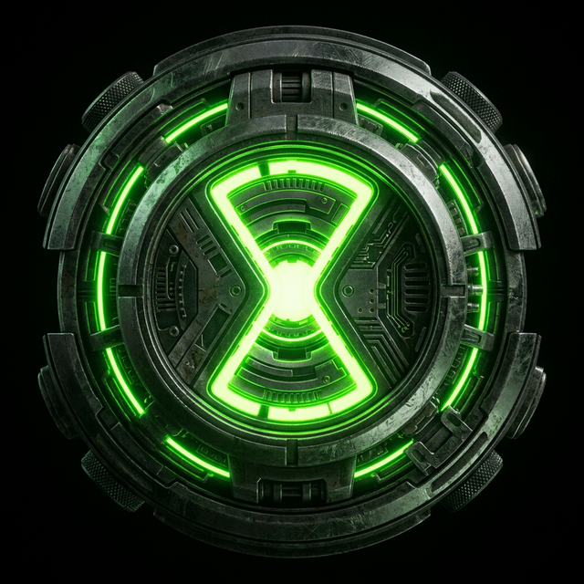
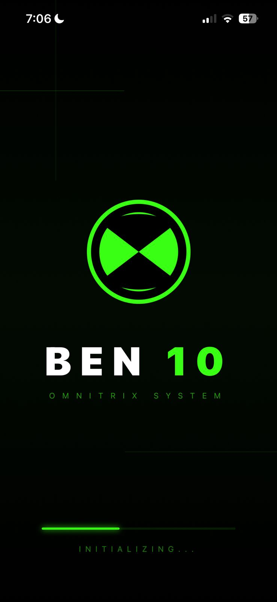
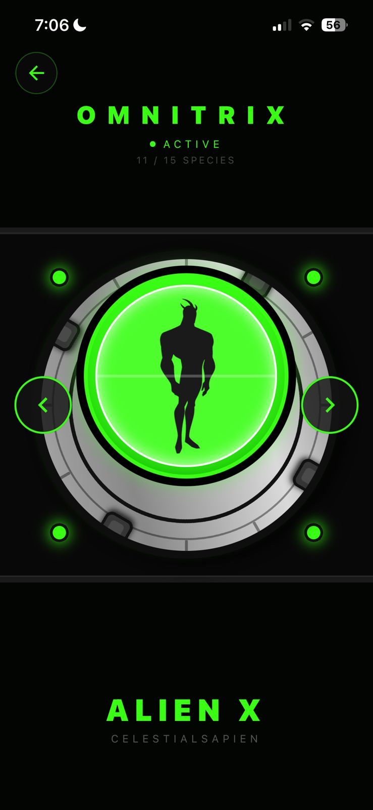
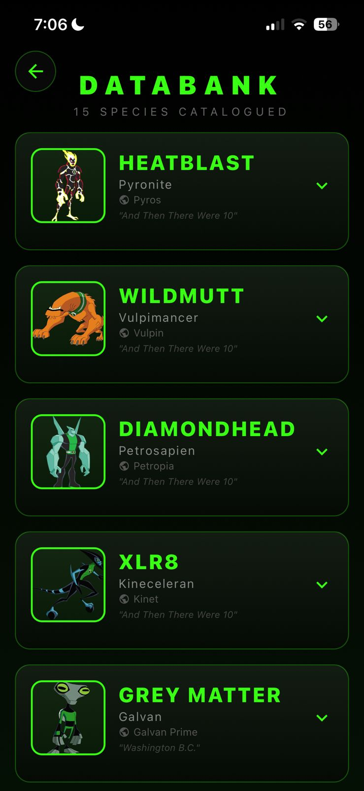
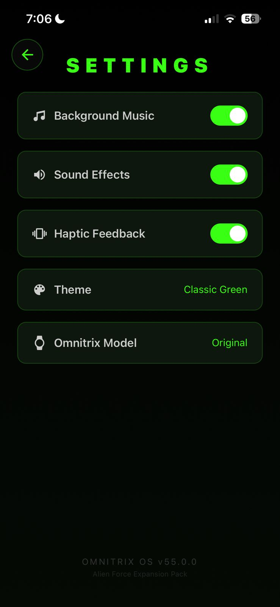
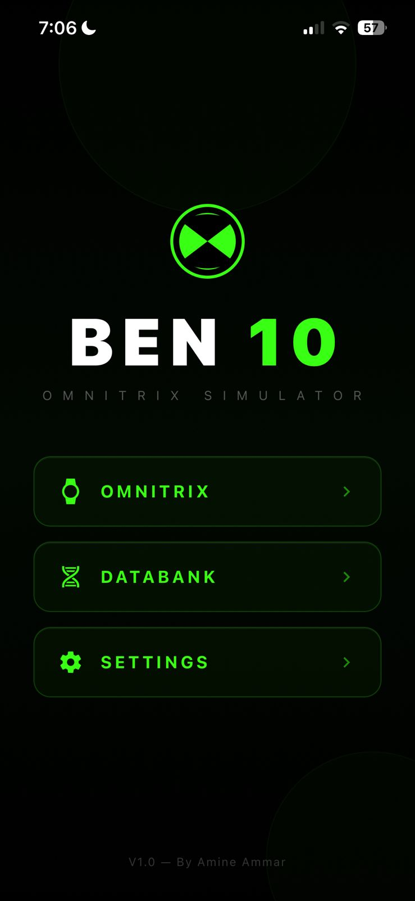

<div align="center">
  
  <h1>Ben 10 Omnitrix App</h1>
  <p><strong>The Ultimate Alien Transformation Experience on your Mobile Device!</strong></p>
  
  <p>
    
    
    
  </p>
</div>

## Overview

Welcome to the **Ben 10 Omnitrix App**! This interactive React Native application brings the iconic Omnitrix to life right on your smartphone. Built with Expo and modern React Native tools, it offers a seamless and realistic Omnitrix simulation, complete with high-quality animations, immersive audio, and a full catalog of your favorite aliens!

## Features

- **Alien Transformations:** Browse through the classic alien roster, including Alien X, and experience the ultimate power in the palm of your hand.
- **Authentic Sound Effects:** Integrated with `expo-audio` for realistic Omnitrix dial, selection, and transformation sounds.
- **Smooth Animations:** Powered by `react-native-reanimated` for fluid transitions, dynamic movements, and a visually stunning UI.
- **Customizable Settings:** Tailor your Omnitrix experience with an intuitive settings menu featuring sleek responsive design.
- **Seamless Onboarding:** Get started quickly with a beautiful, fully-responsive setup flow that prepares you for hero time!

## Screenshots

<div align="center">
  
  
  
  <br />
  <br />
  
  
</div>

## Tech Stack

- **Framework:** [React Native](https://reactnative.dev/)
- **Platform:** [Expo](https://expo.dev/) (SDK 55)
- **Navigation:** [Expo Router](https://docs.expo.dev/router/introduction/)
- **State Management:** [Zustand](https://github.com/pmndrs/zustand)
- **Animations:** [React Native Reanimated](https://docs.swmansion.com/react-native-reanimated/)
- **Media:** `expo-audio`, `expo-image`

## Getting Started

Ready to strap on the watch? Follow these steps:

### Prerequisites

- Node.js (v18+)
- Expo Go app on your iOS/Android device (or an emulator)

### Installation

1. **Clone the repository:**
   ```bash
   git clone https://github.com/yourusername/ben10-app.git
   cd ben10-app
   ```

2. **Install the dependencies:**
   ```bash
   npm install
   ```

3. **Start the Expo development server:**
   ```bash
   npm start
   ```

4. **Launch the App:**
   Scan the QR code with your Expo Go app (Android) or the default Camera app (iOS), or use `a` / `i` to launch an emulator.

## Contribute to Hero Time!

Want to add new aliens (like Upgrade or XLR8) or enhance the UI further? Contributions are highly appreciated!
1. Fork the Project.
2. Create your Feature Branch (`git checkout -b feature/NewAlien`).
3. Commit your Changes (`git commit -m 'Add NewAlien logic'`).
4. Push to the Branch (`git push origin feature/NewAlien`).
5. Open a Pull Request.

## Disclaimer

This project is a fan-made creation developed for educational purposes. "Ben 10", the Omnitrix, and all related characters and properties are trademarks and copyrights of Cartoon Network.

---
<div align="center">
  <i>"It's Hero Time!"</i>
</div>
